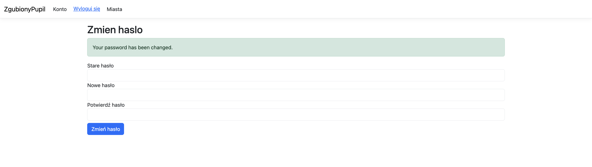
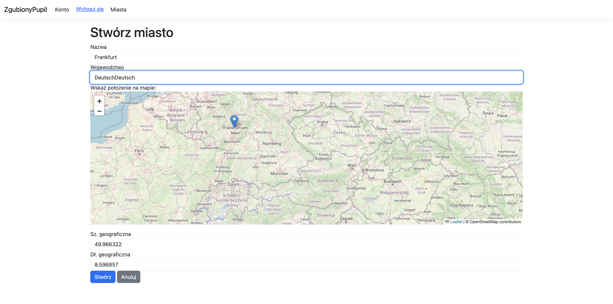

# Aplikacja LostDogApp

Jest to aplikacja oparta na platformie .NET 8 służąca do zgłaszania zaginionych psów, zbudowana z wykorzystaniem ASP.NET Core oraz Entity Framework Core, z bazą danych PostgreSQL. Aplikacja jest konteneryzowana za pomocą Docker i zarządzana przy użyciu Docker Compose.

## Wymagania wstępne

- **Docker**: Zainstaluj Docker Desktop (lub Docker CLI na Linux).
- **Docker Compose**: Zawarty w Docker Desktop lub instalowany oddzielnie.
- **.NET SDK 8.0**: Opcjonalne, wymagane tylko do lokalnego programowania poza Dockerem.
- **Git**: Do klonowania lub zarządzania repozytorium.

## Struktura projektu

- `Dockerfile`: Do budowania wersji produkcyjnej (używa `mcr.microsoft.com/dotnet/aspnet:8.0`).
- `dev.Dockerfile`: Do programowania i migracji (używa `mcr.microsoft.com/dotnet/sdk:8.0`).
- `docker-compose.yml`: Definiuje usługi dla programowania (`web-dev`, `postgres`) oraz opcjonalnie dla produkcji (`web`).
- `docker-compose-migrate.yml`: Definiuje usługi do uruchamiania migracji bazy danych (tylko `migration`).


## Diagram ERD
Dla projektu przygotowano diagram ERD.


## Konfiguracja

1. **Sklonuj repozytorium**:
   ```bash
   git clone https://github.com/Tnovyloo/dotnet-find-lost-dog
   cd LostDogApp
   ```

2. **Sprawdź konfigurację**:
   Upewnij się, że plik `appsettings.json` zawiera poprawny ciąg połączenia z bazą danych:
   ```json
   {
     "ConnectionStrings": {
       "DefaultConnection": "Host=postgres;Port=5432;Database=lostdogapp;Username=lostdog;Password=password"
     }
   }
   ```
   Sprawdź, czy istnieje plik `appsettings.Development.json` i w razie potrzeby zaktualizuj go podobnie.

## Uruchamianie aplikacji

Aplikację można uruchomić w trybie programistycznym za pomocą pliku `docker-compose.yml`, który uruchamia bazę danych `postgres` oraz usługę `web-dev` z funkcją automatycznego przeładowania.


### Kroki

1. **Uruchom aplikację**:
   ```bash
   # Buduje i uruchamia usługi w trybie odłączonym
   docker compose -f docker-compose.yml up -d
   ```

2. **Dostęp do aplikacji**:
   - Otwórz `http://localhost:8080` w przeglądarce.
   - Usługa `web-dev` używa `dotnet watch` do automatycznego przeładowania, więc zmiany w kodzie w folderze `LostDogApp/` są od razu widoczne.

3. **Sprawdź logi**:
   ```bash
   docker compose -f docker-compose.yml logs
   ```

4. **Zatrzymaj aplikację**:
   ```bash
   docker compose -f docker-compose.yml down
   ```

### Uwagi

- Usługa `postgres` przechowuje dane w wolumenie Docker `pgdata`.
- Jeśli porty `8080` lub `5432` są zajęte, edytuj plik `docker-compose.yml`, aby zmienić porty hosta (np. `8081:8080`).
- Dla środowiska produkcyjnego odkomentuj usługę `web` w pliku `docker-compose.yml` i uruchom:
  ```bash
  docker compose -f docker-compose.yml up -d web
  ```

## Uruchamianie migracji bazy danych

Migracje bazy danych są zarządzane za pomocą pliku `docker-compose-migrate.yml`, który definiuje usługę `migration`. Umożliwia to stosowanie migracji Entity Framework Core niezależnie od uruchamiania usługi `web-dev`. Aby uruchomić usługę `migration`, upewnij się, że główna usługa `postgres` (z pliku `docker-compose.yml`) jest uruchomiona.

### Kroki

1. **Zbuduj usługę migracji**:
   ```bash
   docker compose -f docker-compose-migrate.yml build
   ```

2. **Uruchom migracje**:
   ```bash
   docker compose -f docker-compose-migrate.yml up
   ```

3. **Zweryfikuj migracje**:
   Sprawdź schemat bazy danych:
   ```bash
   docker compose -f docker-compose.yml exec postgres psql -U lostdog -d lostdogapp -c "\dt"
   ```
   Sprawdź historię migracji:
   ```bash
   docker compose -f docker-compose.yml exec postgres psql -U lostdog -d lostdogapp -c "SELECT * FROM __EFMigrationsHistory;"
   ```


## Instrukcja obsługi

### Logowanie i rejestracja

1. **Rejestracja użytkownika**:
   - Przejdź na stronę rejestracji, aby utworzyć nowe konto. Wypełnij formularz, podając dane, takie jak adres e-mail, hasło i potwierdzenie hasła. Hasło musi spełniać wymagania bezpieczeństwa (np. minimalna długość, znaki specjalne), co jest pokazane na zrzucie 


2. **Logowanie**:
   - Na stronie logowania wprowadź poprawny adres e-mail i hasło. W przypadku błędnych danych pojawi się komunikat o nieudanym logowaniu, widoczny na zrzucie 

3. **Zmiana hasła**:
   - Zalogowani użytkownicy mogą zmienić hasło w sekcji edycji konta. Po pomyślnej zmianie zobaczysz potwierdzenie, jak na zrzucie 

### Zarządzanie kontem

1. **Edycja danych użytkownika**:
   - W sekcji konta zalogowanego użytkownika możesz edytować dane, takie jak imię czy dane kontaktowe, co pokazano na zrzutach  i 
   - Anonimowi użytkownicy próbujący uzyskać dostęp do widoku konta zobaczą błąd, jak na zrzucie 

### Dodawanie i zarządzanie miastami

1. **Dodawanie miast**:
   - Tylko zalogowani użytkownicy mogą dodawać nowe miasta, które są używane do filtrowania zgłoszeń. Formularz dodawania miasta jest pokazany na zrzucie 
   - Po dodaniu miasta zobaczysz potwierdzenie, jak na zrzucie . Lista miast jest dostępna na widoku 
   - Nieautoryzowani użytkownicy próbujący dodać miasto zobaczą błąd 404, widoczny na zrzucie 

2. **Edycja miast**:
.

3. **Seedowanie miast**:
   - Administratorzy mogą seedować bazę danych miastami, ale ta funkcja jest dostępna tylko dla uprawnionych użytkowników. Próba dostępu przez nieautoryzowanego użytkownika również skutkuje błędem 404 

### Zgłaszanie i zarządzanie zgłoszeniami zaginionych psów

1. **Tworzenie zgłoszenia**:
   - Zalogowani użytkownicy mogą zgłosić zaginionego psa, wypełniając formularz, jak pokazano na zrzucie .


2. **Edycja zgłoszenia**:
   - Użytkownicy mogą edytować zgłoszenia, w tym zmieniać miasto lub zdjęcie psa, co pokazano na zrzucie 
   - Po aktualizacji zgłoszenia zobaczysz zaktualizowany widok, jak na zrzucie 

3. **Walidacja zgłoszeń**:
   - W przypadku błędów w formularzu zgłoszenia (np. brak wymaganych pól), aplikacja wyświetli komunikaty walidacji, widoczne na zrzucie 

4. **Przeglądanie szczegółów zgłoszenia**:
   - Szczegółowy widok zgłoszenia, w tym dane psa i lokalizacja, jest dostępny na zrzucie 

### Komentowanie zgłoszeń

1. **Dodawanie komentarzy**:
   - Zalogowani użytkownicy mogą dodawać komentarze do zgłoszeń, jak pokazano na zrzucie 

2. **Usuwanie komentarzy**:
   - Właściciel komentarza widzi przycisk usuwania, jak na zrzucie 
   - Inni użytkownicy nie widzą przycisku usuwania, co pokazano na zrzucie 

### Filtrowanie i paginacja zgłoszeń

1. **Strona główna i filtrowanie**:
   - Strona główna  wyświetla listę zgłoszeń zaginionych psów.
   - Możesz filtrować zgłoszenia po mieście  i  lub województwie 

2. **Paginacja**:
 i 

### Uwagi

- **Automatyczne przypisywanie miasta**: Aplikacja używa metody Haversine do określenia najbliższego miasta na podstawie współrzędnych zgłoszenia, co ułatwia późniejsze filtrowanie.
- **Ograniczenia dostępu**: Funkcje takie jak dodawanie miast czy seedowanie danych są dostępne tylko dla zalogowanych użytkowników. Próby dostępu przez nieautoryzowanych użytkowników skutkują błędem 404.
- **Walidacja i bezpieczeństwo**: Wszystkie formularze zawierają walidację, a hasła muszą spełniać określone wymagania bezpieczeństwa.